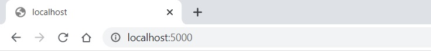
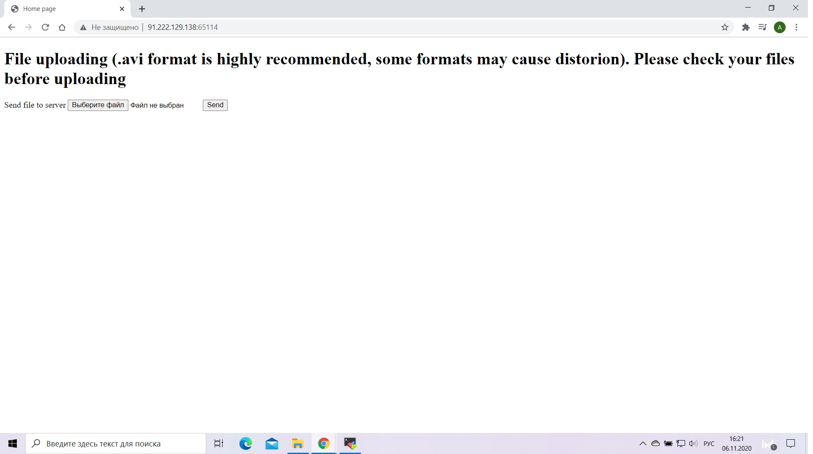
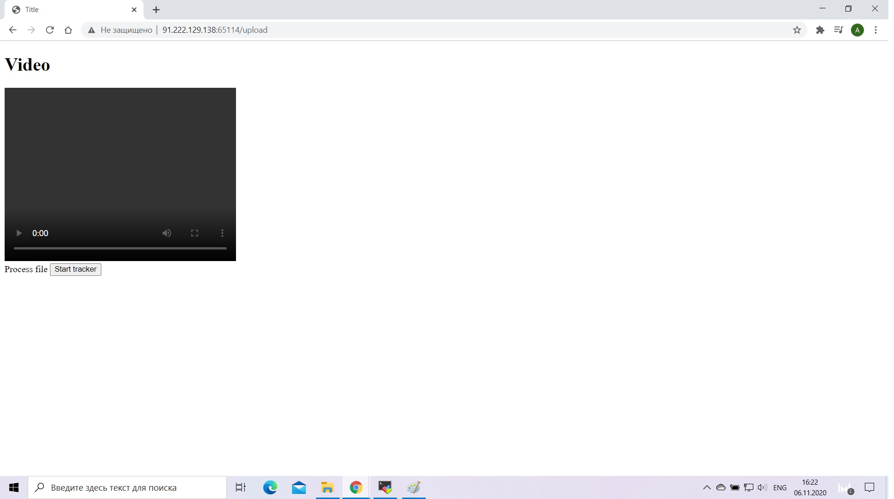
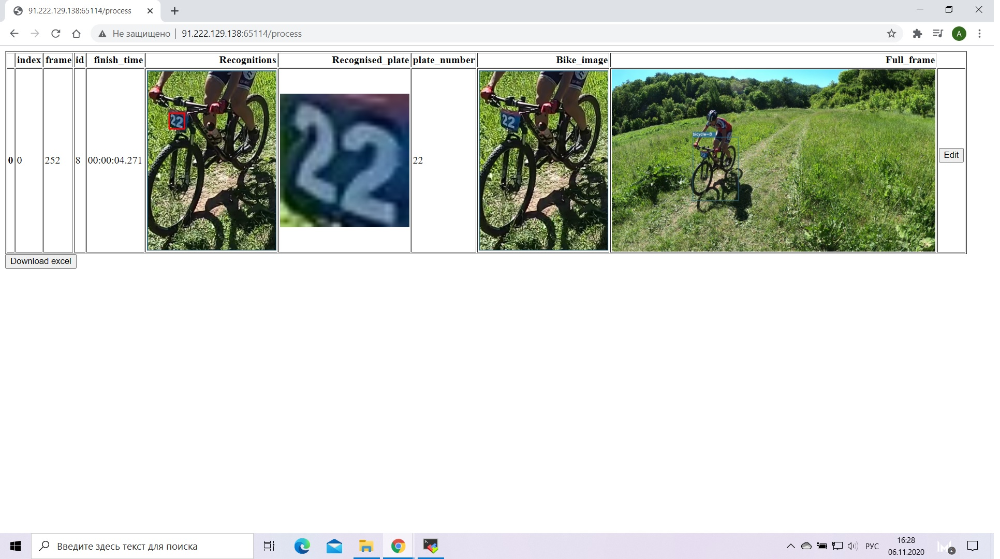
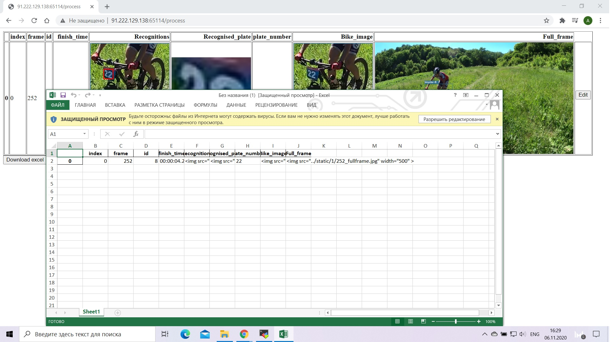
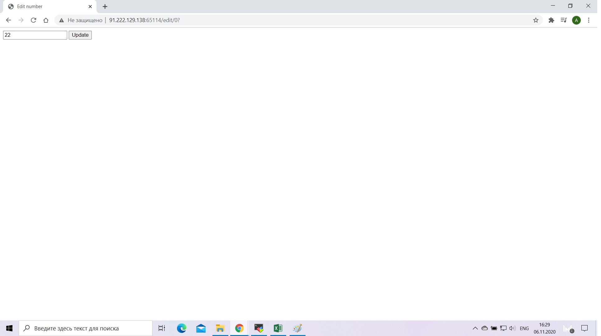

## Bike tracker

## Getting started
### Install dependencies
#### Requirements
```
conda env create -f conda-gpu.yml
conda activate project
conda install pytorch torchvision torchaudio cudatoolkit=10.2 -c pytorch
conda install -c anaconda scikit-image
conda install -c conda-forge moviepy
conda install -c anaconda absl-py
conda install -c conda-forge python-lmdb
```
if after creating the environment some of modules can't be found please search the proper way of installation on the Internet (some modules can be missed also)
 
### Getting models and weights
- https://drive.google.com/file/d/1Jk4eGD7crsqCCg9C9VjCLkMN3ze8kutZ/view (get craft_mlt_25k.pth and place it into bike_tracker/text-detection/weights)
- https://drive.google.com/drive/folders/15WPsuPJDCzhp2SvYZLRj8mAlT3zmoAMW (get TPS-ResNet-BiLSTM-Attn.pth and place it into bike_tracker/text-recognition/weights)
- https://pjreddie.com/media/files/yolov3.weights (get yolov3.weights and place it into bike_tracker/weights folder)
```
python load_weights.py
```
### Database connectivity
Download and install PostgreSQL and specify your url, login, password and db name in the following files:
```
bike_tracker/object_tracker.py
```
```
bike_tracker/webapp.py
```


### Run project
``` (with python 3.7)
python webapp.py 
```
### Try application
Go to 
```
localhost:5000 
```
in your browser (I access the application from the remote server so I have another address).



You gonna see this page. Upload your video and click "Send".



The next page will show your video (it should be working if you uncomment 40th line of webapp.py (you can face some problems with codec so it is commented for now)). Here you can click "Start tracker".



After processing the video you gonna see the results.



Here you can download the results as an xslx report.



Or edit plate numbers (if they do not match with the real ones).



